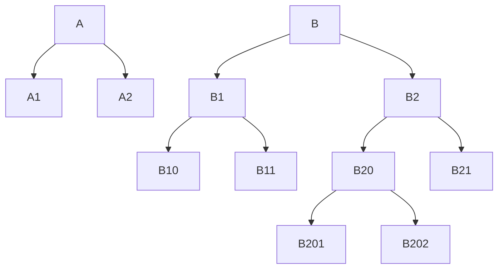

# retraced-assignment

## Task
Build a simple RESTful API to return the category tree (recursively) with a filter
parameter function:

1. api/categories -> return full category tree
2. api/categories?id=1 -> return category tree with the root node as id = 1


## Result
http://localhost:3000/api/categories?id=1

```{
data: [
{
id: 2,
parentId: 1,
name: "A1"
},
{
id: 5,
parentId: 1,
name: "A2"
}
],
responseCode: 200
}
```

## How to run

1. clone and cd to this project
2. `$ docker-compose up --build`
3. run ./script.sql for databse schema and stored procedure setup.
4. You can run test cases using `$ APP_ENV=dev npm run test`
5. For API documentation refer swagger link: localhost:3000/api-docs

## Assumptions:

1. Category name would not exceed 100 characters.
2. For Categories table : ParentId can be NULL(`/root`) and always less than Id.
3. All subcategory names should be unique in their respective categories.
